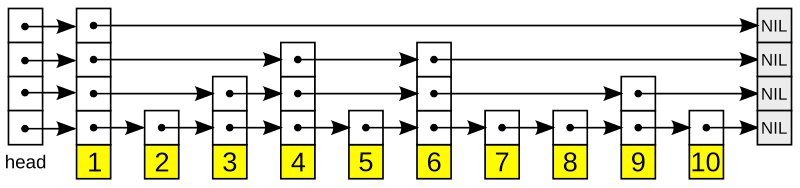

### SkipList
1 - What is a SkipList?

#### What is a SkipList?
```
1 - A skip list is a data structure athat allows for efficient search, insertion and deletion of elements in a sorted list.
2 - It is a probabilistic data structure, meaning that it's avg time complexity is determinded through probabilistic analysis.
```

#### How SkipList Works?


1 - A skip list is built in layers. The bottom layer 1 is an ordinary ordered linked list. Each higher layer acts as an "express lane" for the lists below, where an element in layer i  appears in layer i + 1  with some fixed probability p (two commonly used values for p are 1/2 or 1/4. On average, each element appears in 1/(1−p) lists, and the tallest element (usually a special head element at the front of the skip list) appears in all the lists. The skip list contains log<sub>1/p</sub>n lists. 

#### Skip List Time Complexities

```
1 - Search    : O(log(n))
2 - Insertion : O(log(n))
3 - Deletion  : O(log(n))
```
#### Skip List Pros
```
1 - The skip list is solid and trustworthy.
2 - To add a new node to it, it will be inserted extremely quickly. 
3 - Easy to implement compared to the hash table and binary search tree
4 - The number of nodes in the skip list increases, and the possibility of the worst-case decreases
5 - Requires only ?(logn) time in the average case for all operations.
6 - Finding a node in the list is relatively straightforward.
```
#### Skip List Cons
```
1 - It needs a greater amount of memory than the balanced tree.
2 - Reverse search is not permitted.
3 - Skip lists are not cache-friendly because they don't optimize the locality of reference
```