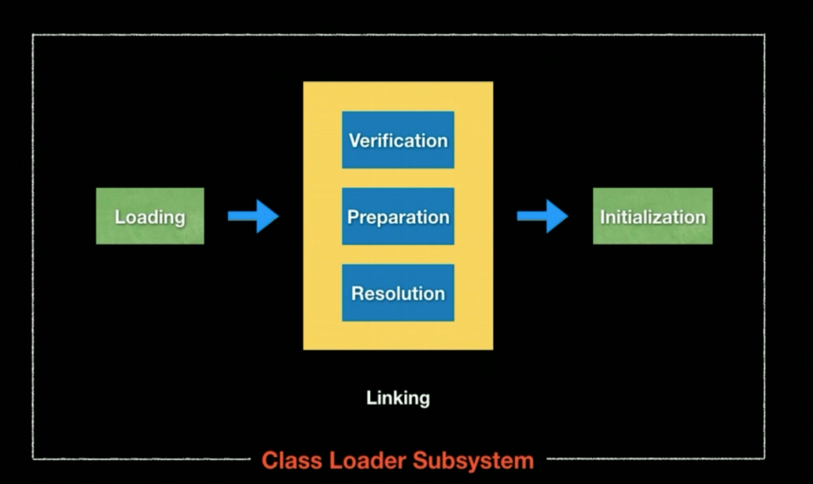
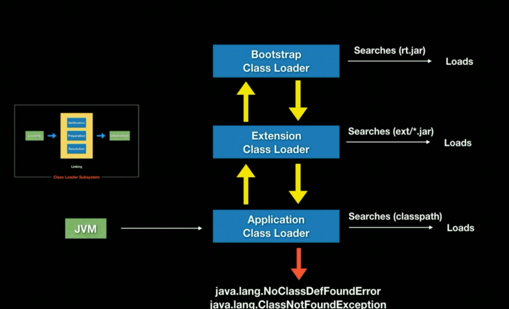

## Java JVM and Garbage Collection

### Classloaders

#### What is a Classloader?
```
1 - Set of components which loads classes into JVM during runtime.
2 - Not all classes loaded at once, when program needs that a particular class, Java Classloader loads it into memory. 
```

#### What activities are performed by Classloader Subsystem?



```
1 - Loading 

    1 - Reads class and generate binary code, which gets stored in method area. (An area in JVM Memory, Stack, Not Shared)
    2 - Creates an Object of type java.lang.Class, which gets stored in heap area. (Another area in JVM Memory, Shared)
    
2 - Linking

    1 - Verify
        1 - Verifies bytecode
        
    2 - Prepare
        1 - JVM allocates memory to class level variables and assigns default values to them.

    3 - Resolve
        1 - JVM replaces Symbolic Names with original memory references from the Method Area.

3 - Initialization

    1 - Original values get assigned to static variables.
    2 - Static blocks gets executed from parent to chile (top to bottom).
```

#### What are different class loaders used by JVM?
```
1 - Bootstrap or Premordial Classloader 
    
    1 - loads core java api classes i.e (jre/lib/rt.jar)
    2 - Parent of all other class loaders in Java.
    
2 - Extention Classloader

    1 - loads classes from (jre/lib/ext/*.jar)
    2 - Extention class loader is implementations of Bootstrap Classloader

3 - Application or System Classloader

    1 - loads classes from CLASSPATH env variable.
    2 - Child of ExtentionClassloader.
```

#### How does JVM load classes?
```
1 - Classloader works by delegating, one classloader delegates the responsibility of loading the class to their parent, if that doen't happen, then it them by itself.
```


#### What is the difference between static & dynamic class loading?
```
Static class loading  : 
    1 - Default process of class loading.
    2 - Classes are statically loaded when we call them.
    
Dynamic class loading : 
    1 - Dynamic loading allows programmatically invoking of the functions of a class loader at runtime.
    2 - For example:
        
        Class c = ClassLoader.loadClass("Demo");
        Class c = Class.forName("Demo");
```

#### Class.forName() vs ClassLoader.loadClass()
```
1 - Both methods try to load classes dynamically.
2 - By default classes get initialized using Class.forName() method.
3 - loadClass() is an instance method and requires a particular ClassLoader to load the class. By default, classes do not get initialized in loadClass().
```