## Java JVM and Garbage Collection

### Memory Areas

#### What are various memory areas present in JVM?

```
JVM has 5 memory areas:
1 - Method area
2 - Stack area
3 - Heap area
4 - PC Registers
5 - Native method area
```

#### Which memory area is used to store static variables?
```
1 - JVM Stores Class level info in the Method area.
2 - Class level info consists of 
    1 - Class name
    2 - Parent class name
    3 - Method info
    4 - Variables info, etc.
3 - Constructors, Modifiers info, Constant pool info, etc.
4 - When we start JVM, a method area gets created and that will be shared among all JVM threads.
```

#### When are static variables loaded in memory?
```
1 - Static variables gets loaded at the time of class loading and gets stored in the method area.
```

#### What is Heap space in Java?
```
1 - Heap memory in JVM is used to store objects and corresponding instance variables.
2 - Whenever we create objects, it is always created in Heap Space.
3 - Heap area gets created when we start JVM. 
4 - Heap area is shared among all JVM threads.
5 - Method & heap area need not to be continuous.
```

#### What is String pool?
```
1 - String pool or string intern pool is a special storage area in Heap.
2 - When we create a string, it gets stored to the string pool to avoid duplicate strings.
```
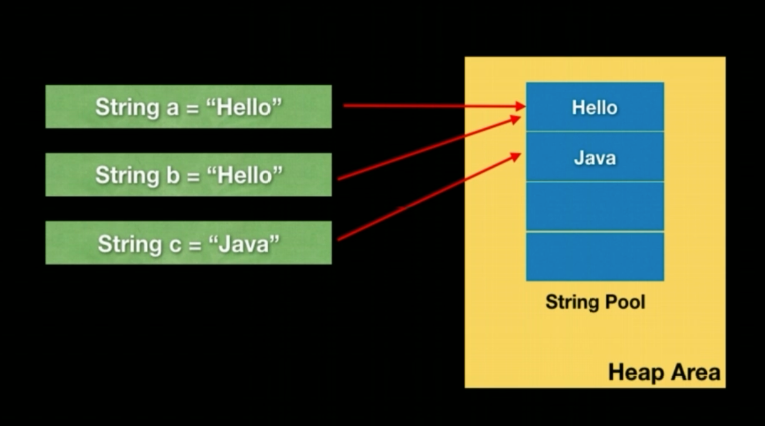

#### What is Stack? What it stores?
```
1 - A memory area where a thread loads a method.
```
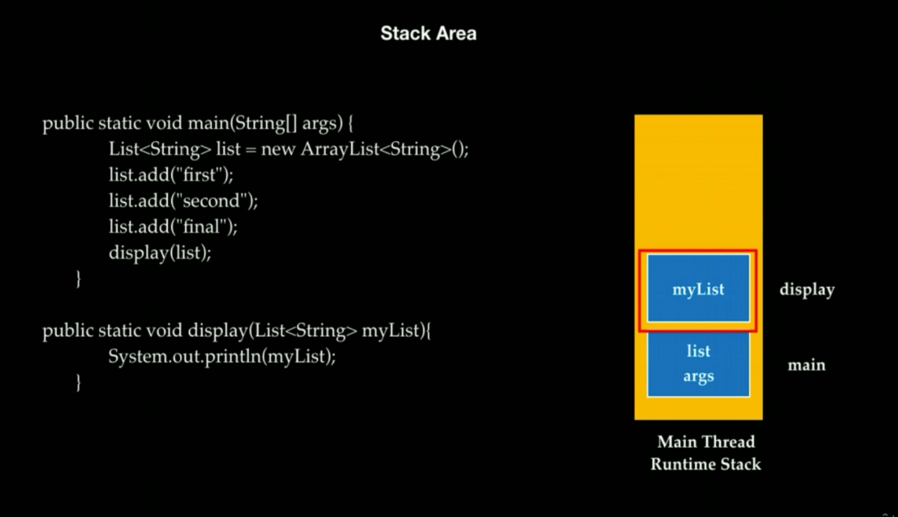


#### What is stack frame? What does it consist?
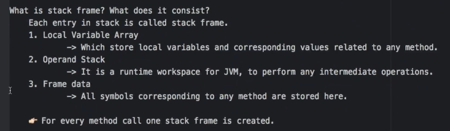

#### How stack & heap are interrelated?

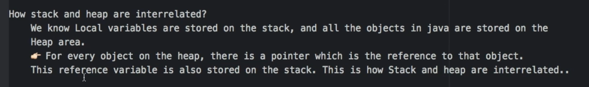
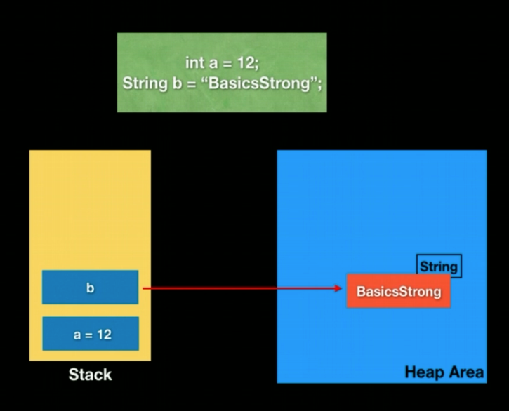
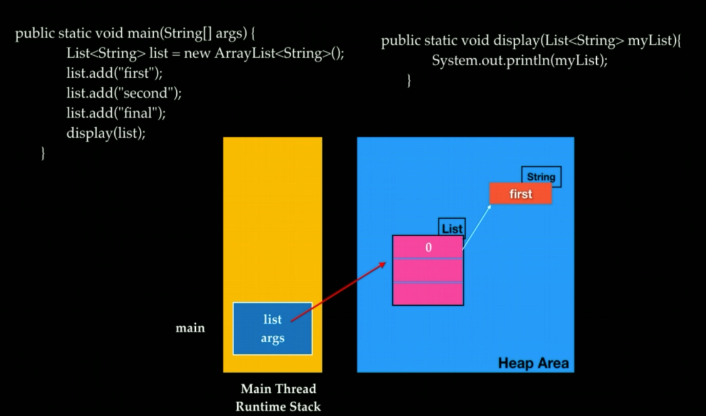

#### How to get info about heap memory?
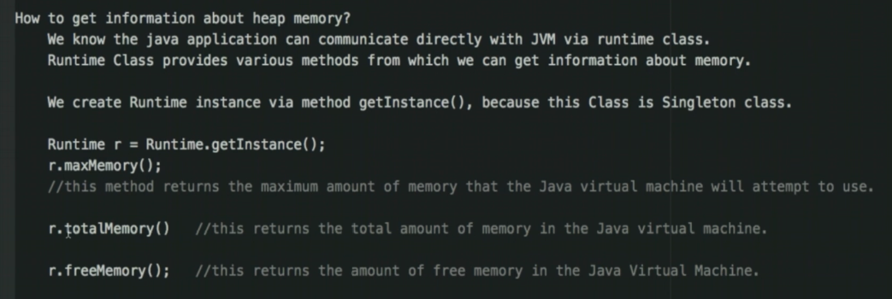

#### What happens when there is not enough Heap Space for storing new Objects?
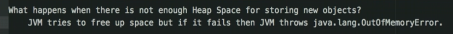

#### How to set minimum & maximum heap size?
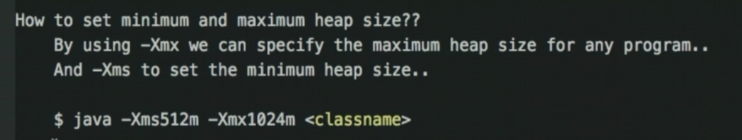

#### Why do member variables have default values but local variables do not?
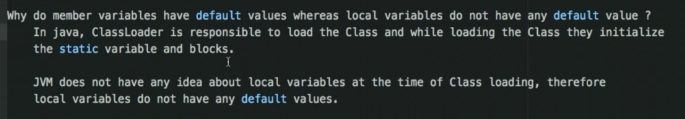

#### What PC registers are for?
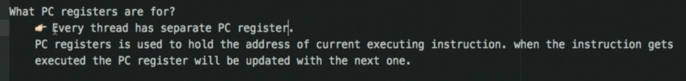

#### What is Native Method Stack?
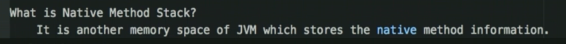