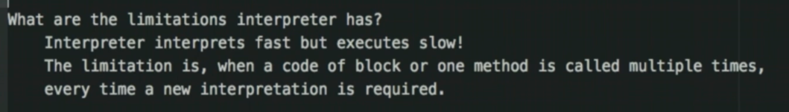

## Java JVM and Garbage Collection

#### What is Execution Engine, what it does?

#### What is Interpreter?

#### What are the limitations Interpreter has?

#### What is JIT Compiler?

#### Components of JIT Compiler?

#### What is a Garbage Collector?
