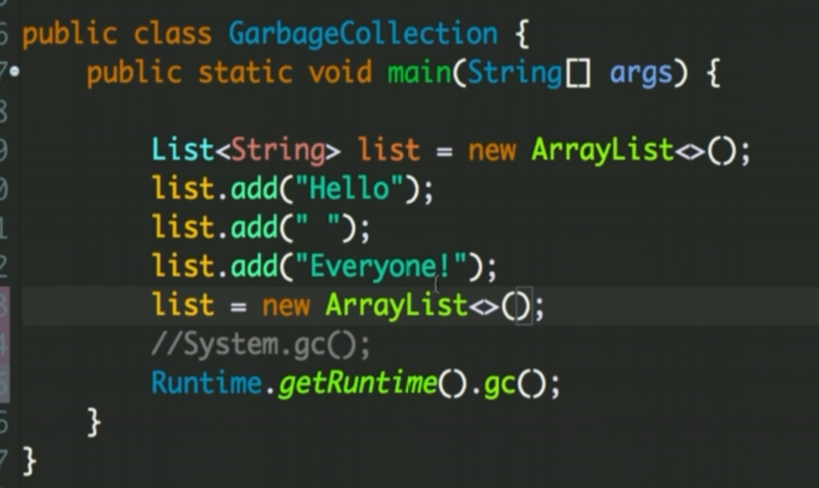

## Java JVM and Garbage Collection

#### What is Garbage Collections?


#### Which objects are eligible for Garbage Collection?


#### Is programmer responsible for to destroy objects?


#### How to make an object available for GC?


#### How to call GC?



#### Can you guarantee that invoking GC will definitely call GC?
```
No. Not necessarily. 
```

#### If an object reference is set to null, will the GC immediately free the memory held by that object?
```
Not necessarily. It will free in next cycle of GC run.
```

#### When should we call GC to run?


#### Why is it bad idea to run GC?


#### When is the finalize() method gets called? What is the purpose of calling it?


#### Why we should not use finalize() method?


#### So there is no use of finalize method?
```
This method is deprecated since Java 9.
```

#### What are memory leaks? What are soft references?
```
Memory Leaks:

    1 - Unused object in consuming memory is called Memory Leak. 
    2 - Objects not in use that are not Garbage Collected, as they have been somehow referenced from Stack. As a result application is consuming more memory then actually needed. This may cause OutOfMemoryError.

Soft References :

    1 - Objects that are eligible for GC but are not garbage collected until JVM needs to free memory to keep running.
    2 - These objects gets GCed only when JVM runs out of memory.
```