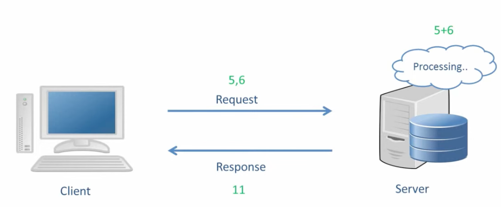
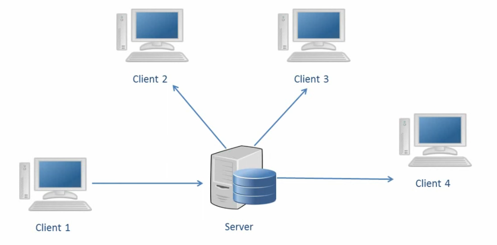
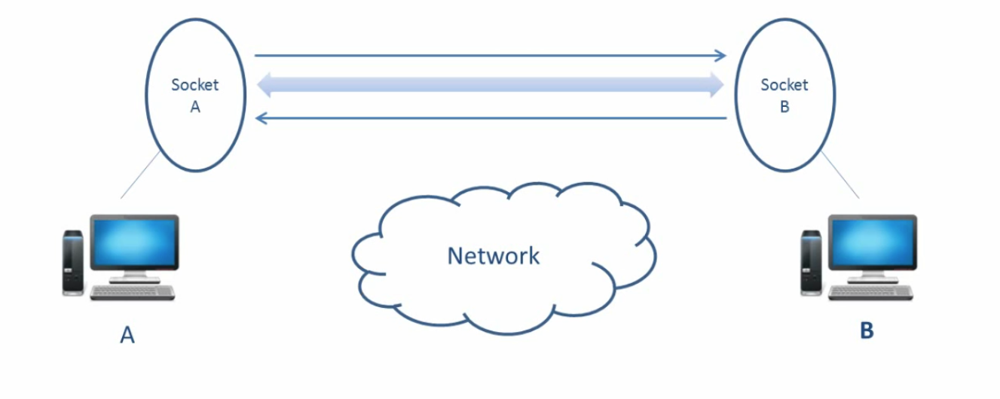
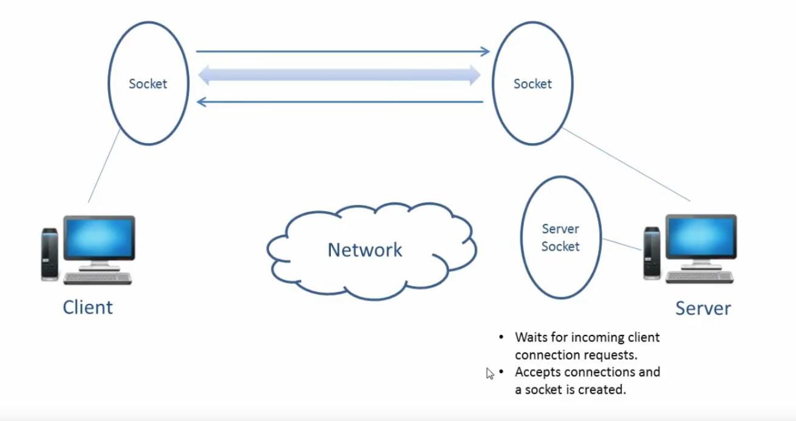

## Java Networking

#### Networking Basics
1 - TCP vs UDP

#### Client Server Architecture

 


#### What is a Socket?
```
1 - A Socket is an endpoint of communication between 2 devices.
2 - In Java, a Socket is treated as an object of class Socket. Each Socket as 2 streams:
    1 - Input stream  : To recieve messages.
    2 - Output stream : To send messages.
```


#### What is a ServerSocket?
```
1 - Server uses ServerSocket to wait for client to make connection.
2 - When Client makes a connection, Server accepts the connection and Server creates a Socket to communicate with client.
```


#### Connecting client and server using sockets in Java.
