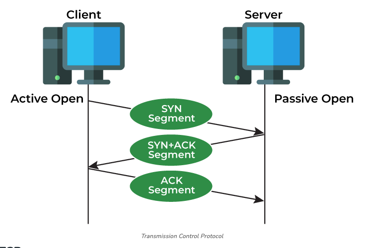
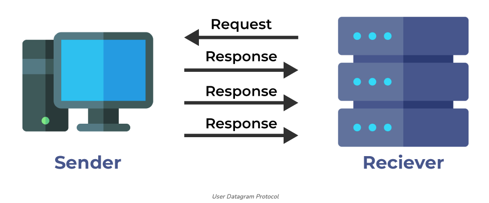
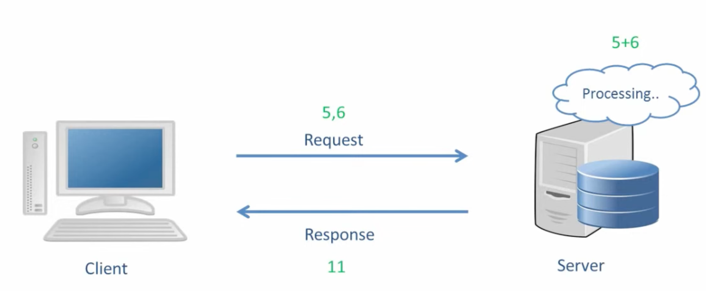
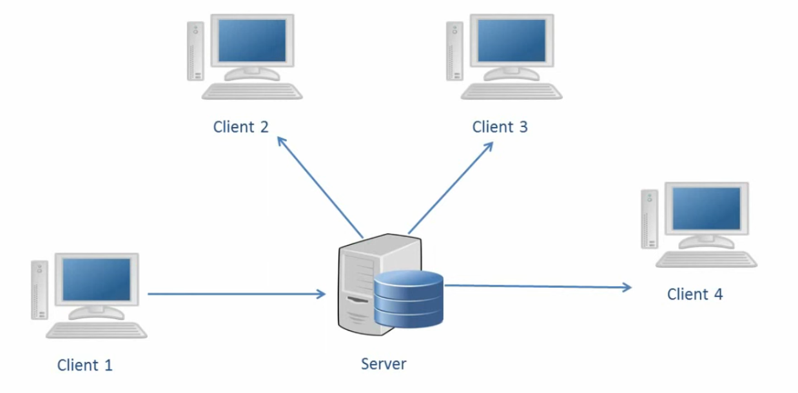
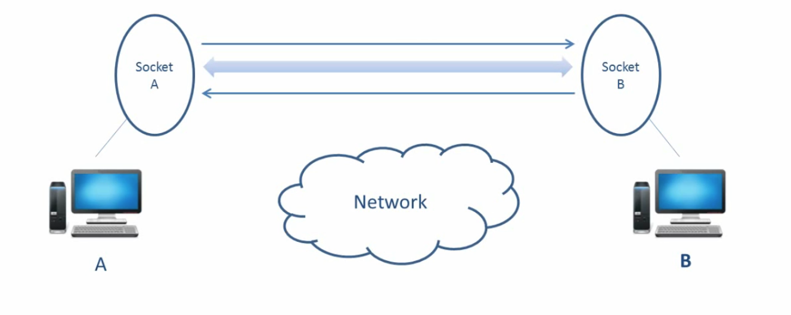
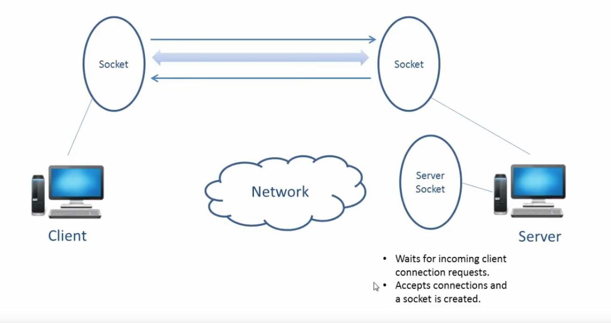

## Java Networking

### Networking Basics : TCP vs UDP
```
TCP
    1 - Transmission Control Protocol
    2 - Transport layer protocol.
    3 - TCP is connection oriented. (Handshake)
    4 - Slower than UDP.
    5 - Applications:
        1 - Web, SMTP, FTP, SSH, Streaming Media.
    
UDP
    1 - User Datagram Protocol
    2 - Transport layer protocol.
    3 - UDP is connectionless and unreliable.
    4 - Low latency and loss-tolerating connections. Faster than TCP.
    5 - Applications:
        1 - Live streaming, video calls, onlike gaming, DNS.
```




### Client Server Architecture

 


### What is a Socket?
```
1 - A Socket is an endpoint of communication between 2 devices.
2 - In Java, a Socket is treated as an object of class Socket. Each Socket as 2 streams:
    1 - Input stream  : To recieve messages.
    2 - Output stream : To send messages.
```


### What is a ServerSocket?
```
1 - Server uses ServerSocket to wait for client to make connection.
2 - When Client makes a connection, Server accepts the connection and Server creates a Socket to communicate with client.
```


### Connecting client and server using sockets in Java.
```
1 - Server: socketprogramming.EchoServer
2 - Client: socketprogramming.EchoClient
```